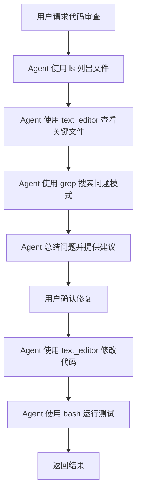
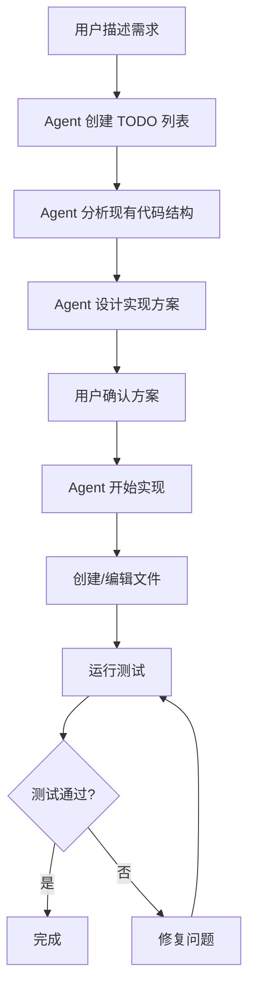
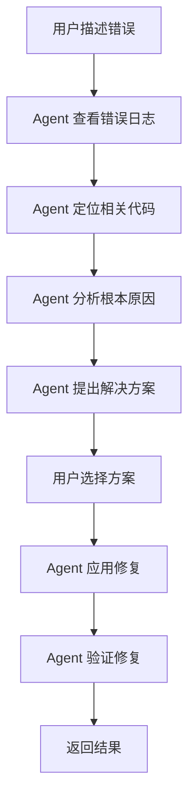

# DeerCode 业务流程文档

## 目录
- [1. 产品定位](#1-产品定位)
- [2. 核心业务流程](#2-核心业务流程)
- [3. 用户场景](#3-用户场景)
- [4. 功能详解](#4-功能详解)
- [5. 业务规则](#5-业务规则)
- [6. 未来规划](#6-未来规划)

---

## 1. 产品定位

### 1.1 产品愿景

**DeerCode = 教育 + 实用**

```
让每个人都能学会构建 AI 编码助手
Make AI Coding Agents Accessible to Everyone
```

### 1.2 目标用户

#### 主要用户群体

| 用户类型 | 需求 | 解决方案 |
|---------|------|---------|
| **AI 初学者** | 学习如何构建 AI Agent | 清晰的代码结构、详细注释 |
| **开发者** | 提高编码效率 | 完整的编码助手功能 |
| **教育者** | 教学案例 | 可定制、易扩展 |
| **研究者** | Agent 框架研究 | 标准 ReAct 实现 |

#### 用户画像

**1. 小李 - AI 应用开发者**
- 背景：3 年 Python 经验，对 AI 感兴趣
- 目标：学习构建自己的 AI 工具
- 使用 DeerCode：
  - 研究代码结构
  - 修改 Prompt 模板
  - 添加自定义工具

**2. 王老师 - 高校教师**
- 背景：教授 AI 相关课程
- 目标：给学生提供实践项目
- 使用 DeerCode：
  - 课堂演示 Agent 工作原理
  - 学生作业：扩展功能
  - 研究 ReAct 框架

**3. 张工 - 独立开发者**
- 背景：全栈开发，维护多个项目
- 目标：提高日常开发效率
- 使用 DeerCode：
  - 快速浏览代码库
  - 执行重复性任务
  - 代码重构辅助

### 1.3 核心价值

#### 对学习者
- **简洁清晰**：代码易读，架构明确
- **完整示例**：包含所有关键功能
- **可扩展**：方便添加新功能

#### 对使用者
- **实用工具**：真正能用的编码助手
- **高效交互**：VSCode 风格 TUI
- **开放集成**：支持 MCP 工具

#### 对社区
- **开源免费**：MIT 许可证
- **持续维护**：活跃开发
- **文档完善**：多维度文档

---

## 2. 核心业务流程

### 2.1 用户旅程

```
[启动] → [配置] → [交互] → [完成任务] → [退出]
```

#### 阶段 1: 启动应用

```bash
uv run -m deer_code.main "/path/to/project"
```

**系统操作**：
1. 加载配置文件 `config.yaml`
2. 初始化 LLM 模型
3. 加载 MCP 工具 (异步)
4. 创建 CodingAgent
5. 启动 Textual UI

**预期时间**: 2-5 秒

#### 阶段 2: 用户交互

**交互模式**: 对话式

```
User: "帮我分析这个项目的结构"
  ↓
Agent: 使用 ls 和 tree 工具
  ↓
Terminal View: 显示目录结构
  ↓
Agent: 返回分析结果
  ↓
Chat View: 显示回复
```

#### 阶段 3: 任务执行

**多轮对话示例**：

```
[1] User: "创建一个 FastAPI 应用"
    Agent: 创建 TODO 列表
           1. 创建 main.py
           2. 定义 API 路由
           3. 添加依赖

[2] Agent: 使用 text_editor 创建 main.py
    Editor: 打开文件标签

[3] Agent: 继续完成任务...

[4] User: "添加用户认证"
    Agent: 扩展代码...
```

#### 阶段 4: 退出

- **Ctrl+C**: 安全退出
- **自动保存**: 不需要手动保存

### 2.2 典型工作流

#### 工作流 1: 代码审查



**预期时间**: 2-5 分钟

#### 工作流 2: 功能开发



**预期时间**: 10-30 分钟

#### 工作流 3: 调试问题



**预期时间**: 5-15 分钟

### 2.3 消息流程详解

#### 用户输入处理

```python
# 1. 用户在 ChatInput 输入
user_input = "帮我创建一个 Python 文件"

# 2. 触发 _send_message
@work(exclusive=True, thread=False)
async def _send_message(self, user_input: str):
    # 3. 创建 HumanMessage
    user_message = HumanMessage(content=user_input)

    # 4. 流式调用 Agent
    async for chunk in self._coding_agent.astream(
        {"messages": [user_message]},
        stream_mode="updates",
        config={"thread_id": "thread_1"}
    ):
        # 5. 处理每个 chunk
        await self._process_chunk(chunk)
```

#### Agent 决策过程

```
Chunk 1: Agent 推理
├── 角色: "agent"
├── 内容: "我将创建一个 Python 文件"
└── 工具调用: None
    → UI: 显示在 Chat View

Chunk 2: Agent 调用工具
├── 角色: "agent"
├── 内容: ""
└── 工具调用: [
    {
      "name": "text_editor",
      "args": {
        "command": "create",
        "file_path": "example.py",
        "file_text": "print('Hello')"
      },
      "id": "call_123"
    }
  ]
    → UI: 在 Editor 中创建标签页
    → UI: 显示加载状态

Chunk 3: 工具执行结果
├── 角色: "tool"
├── 内容: "File created successfully"
└── tool_call_id: "call_123"
    → UI: 更新编辑器内容
    → UI: 在 Chat View 显示成功消息

Chunk 4: Agent 总结
├── 角色: "agent"
├── 内容: "文件已创建。需要我添加更多代码吗？"
└── 工具调用: None
    → UI: 显示在 Chat View
```

#### 工具调用路由

```python
# app.py: _process_tool_call_message
tool_name = tool_call["name"]

if tool_name in ["bash", "grep", "ls", "tree"]:
    # 路由到 Terminal View
    terminal = self.query_one(TerminalView)
    terminal.append_command(tool_call["args"])
    self._terminal_tool_calls.append(tool_call_id)

elif tool_name == "text_editor":
    # 路由到 Editor Tabs
    file_path = tool_call["args"]["file_path"]
    editor = self.query_one(EditorTabs)

    if tool_call["args"]["command"] == "create":
        editor.open_file(file_path)
        editor.set_loading(file_path)

    self._mutable_text_editor_tool_calls[tool_call_id] = file_path

elif tool_name == "todo_write":
    # 路由到 TODO List View
    todo_list = self.query_one(TodoListView)
    todo_list.set_loading()
```

---

## 3. 用户场景

### 3.1 场景 1: 快速了解新项目

**用户目标**: 快速理解一个新的代码库

**操作步骤**:
```
1. User: "帮我分析这个项目"
2. Agent:
   - 使用 ls 查看顶层目录
   - 使用 tree 查看目录结构
   - 使用 grep 搜索关键文件 (README, package.json, setup.py)
   - 使用 text_editor 查看配置文件
3. Agent: 返回项目概览
4. User: "main.py 是做什么的？"
5. Agent: 使用 text_editor 查看并解释
```

**业务价值**: 节省 70% 的项目熟悉时间

### 3.2 场景 2: 重构代码

**用户目标**: 重构一个模块以提高可读性

**操作步骤**:
```
1. User: "重构 utils/parser.py，提高可读性"
2. Agent:
   - 创建 TODO:
     [1] 分析当前代码
     [2] 识别可优化点
     [3] 应用重构
     [4] 运行测试
3. Agent: 使用 text_editor 查看当前代码
4. Agent: 提出重构方案
5. User: 确认
6. Agent: 应用 str_replace 操作
7. Agent: 使用 bash 运行 pytest
8. Agent: 报告结果
```

**业务价值**: 自动化繁琐的重构工作

### 3.3 场景 3: 添加新功能

**用户目标**: 为 Web 应用添加用户认证

**操作步骤**:
```
1. User: "添加基于 JWT 的用户认证"
2. Agent:
   - 创建详细 TODO (10+ 项)
   - 搜索现有认证相关代码 (grep "auth")
3. Agent: 设计实现方案
4. User: 讨论并调整方案
5. Agent: 开始实现
   - 创建 models/user.py
   - 创建 auth/jwt.py
   - 修改 main.py 添加中间件
   - 创建 tests/test_auth.py
6. Agent: 运行测试
7. Agent: 返回完整报告
```

**业务价值**: 加速功能开发 50%

### 3.4 场景 4: Debug 问题

**用户目标**: 修复生产环境错误

**操作步骤**:
```
1. User: "用户报告登录失败，错误日志：[粘贴日志]"
2. Agent:
   - 分析日志定位问题点
   - 使用 grep 搜索相关代码 "login"
   - 使用 text_editor 查看登录逻辑
3. Agent: 发现问题 (如：token 验证逻辑错误)
4. Agent: 提出修复方案
5. User: 确认
6. Agent: 应用修复
7. Agent: 建议添加测试用例
8. Agent: 创建测试
```

**业务价值**: 快速定位和修复问题

### 3.5 场景 5: 学习新技术

**用户目标**: 学习如何使用 LangGraph

**操作步骤**:
```
1. User: "教我 LangGraph 的基础用法"
2. Agent:
   - 使用 tavily_search 搜索最新文档
   - 创建示例项目
   - 使用 text_editor 创建 example_agent.py
3. Agent: 添加详细注释解释每行代码
4. User: "如何添加状态管理？"
5. Agent: 扩展示例，添加状态
6. Agent: 使用 bash 运行示例
7. Agent: 解释输出结果
```

**业务价值**: 互动式学习体验

---

## 4. 功能详解

### 4.1 对话管理

#### 4.1.1 多轮对话

**状态保持**:
```python
# 所有对话在同一线程
config = {"thread_id": "thread_1"}

# LangGraph 自动维护历史
state = {
    "messages": [
        HumanMessage("第一轮问题"),
        AIMessage("第一轮回答"),
        HumanMessage("第二轮问题"),  # 可引用之前的上下文
        AIMessage("第二轮回答"),
    ]
}
```

**上下文引用示例**:
```
[1] User: "创建一个 FastAPI 应用"
    Agent: [创建 main.py]

[2] User: "给它添加一个 /health 端点"
                ^^
                引用上一轮创建的应用
    Agent: [理解并修改 main.py]
```

#### 4.1.2 对话历史

**存储**: LangGraph 检查点系统

**访问**:
```python
# 获取历史消息
history = await agent.aget_state(config)
messages = history["messages"]
```

**清空** (未实现，可扩展):
```python
# 创建新线程
config = {"thread_id": f"thread_{uuid.uuid4()}"}
```

### 4.2 任务规划

#### 4.2.1 TODO 系统

**触发条件** (由 Prompt 定义):
- 任务包含 3+ 步骤
- 复杂的多文件修改
- 用户明确要求

**工作流**:
```python
# 1. Agent 创建 TODO
tool_call = {
    "name": "todo_write",
    "args": {
        "action": "add",
        "todos": [
            {"title": "创建数据模型", "status": "pending"},
            {"title": "实现 API 端点", "status": "pending"},
            {"title": "编写测试", "status": "pending"},
        ]
    }
}

# 2. UI 更新 TODO List View
todo_list.update_todos(todos)

# 3. Agent 逐步完成
# 每完成一项，调用 todo_write 更新状态
tool_call = {
    "name": "todo_write",
    "args": {
        "action": "update",
        "todo_id": "todo_1",
        "status": "completed"
    }
}
```

**UI 显示**:
```
TODO List
  ✅ 创建数据模型
  🔄 实现 API 端点 (in progress)
  ⏸️ 编写测试
```

#### 4.2.2 任务分解策略

**简单任务** (无 TODO):
```
User: "查看 config.py"
Agent: [直接使用 text_editor.view]
```

**中等任务** (3-5 步):
```
User: "添加日志功能"
Agent TODO:
  1. 安装 logging 库
  2. 创建 logger 配置
  3. 在主文件中应用
```

**复杂任务** (5+ 步):
```
User: "实现用户认证系统"
Agent TODO:
  1. 设计数据库模型
  2. 创建 User 模型
  3. 实现密码哈希
  4. 创建 JWT 工具函数
  5. 实现登录端点
  6. 实现注册端点
  7. 添加认证中间件
  8. 编写单元测试
  9. 编写集成测试
  10. 更新文档
```

### 4.3 代码操作

#### 4.3.1 文件浏览

**工具**: `ls`, `tree`

**业务场景**:
```
User: "这个项目有哪些测试文件？"
Agent:
  1. 使用 tree 查看结构
  2. 使用 grep 搜索 "test_*.py"
  3. 总结测试文件列表
```

#### 4.3.2 代码搜索

**工具**: `grep`

**业务场景**:
```
User: "找到所有使用 requests 库的地方"
Agent:
  使用 grep: pattern="import requests|from requests"
  返回匹配文件和行号
```

**高级用法**:
```
User: "查找所有 TODO 注释"
Agent:
  grep: pattern="# TODO|// TODO"
  整理成列表返回
```

#### 4.3.3 文件编辑

**工具**: `text_editor`

**操作类型**:

**1. 查看文件**
```python
text_editor(command="view", file_path="main.py")
```

**2. 创建文件**
```python
text_editor(
    command="create",
    file_path="new_module.py",
    file_text="def hello():\n    print('Hello')\n"
)
```

**3. 替换内容**
```python
text_editor(
    command="str_replace",
    file_path="config.py",
    old_str="DEBUG = True",
    new_str="DEBUG = False"
)
```

**4. 插入内容**
```python
text_editor(
    command="insert",
    file_path="app.py",
    insert_line=10,
    new_str="    # 新增的注释\n"
)
```

**业务规则**:
- 编辑前先 view 文件
- 确保 old_str 精确匹配
- 大幅修改用 create 覆盖

#### 4.3.4 命令执行

**工具**: `bash`

**业务场景**:

**1. 运行测试**
```
Agent: bash(command="pytest tests/")
Terminal View: 显示测试输出
```

**2. 安装依赖**
```
Agent: bash(command="pip install fastapi")
Terminal View: 显示安装进度
```

**3. Git 操作**
```
Agent: bash(command="git status")
Agent: bash(command="git add .")
Agent: bash(command="git commit -m 'feat: add new feature'")
```

**4. 构建项目**
```
Agent: bash(command="npm run build")
Terminal View: 显示构建日志
```

**安全考虑**:
- 不执行危险命令 (rm -rf /)
- 提示用户确认敏感操作
- 超时保护 (默认 30 秒)

### 4.4 MCP 集成

#### 4.4.1 MCP 工具加载

**配置**:
```yaml
tools:
  mcp_servers:
    context7:
      transport: 'streamable_http'
      url: 'https://mcp.context7.com/mcp'
```

**加载流程**:
```python
# 1. 启动时异步加载
mcp_tools = await load_mcp_tools()

# 2. 合并到 Agent 工具列表
tools = [bash_tool, ..., *mcp_tools]

# 3. Agent 可以调用 MCP 工具
# (与内置工具无区别)
```

#### 4.4.2 MCP 工具示例

**Context7 MCP**:
- `context7_search`: 搜索代码库
- `context7_get_context`: 获取上下文

**使用场景**:
```
User: "在大型项目中找到认证逻辑"
Agent:
  1. 使用 context7_search(query="authentication")
  2. 获取相关文件列表
  3. 使用 text_editor 查看关键文件
  4. 总结认证实现
```

### 4.5 网络搜索

**工具**: `tavily_search`

**业务场景**:
```
User: "FastAPI 的最新最佳实践是什么？"
Agent:
  1. tavily_search(query="FastAPI best practices 2025")
  2. 分析搜索结果
  3. 总结要点
  4. (可选) 应用到当前项目
```

**配置**:
```bash
export TAVILY_API_KEY="your_key"
```

---

## 5. 业务规则

### 5.1 工具调用规则

#### 5.1.1 工具选择优先级

```
1. 优先使用精确工具
   - 查看文件 → text_editor.view (不是 bash cat)
   - 搜索代码 → grep (不是 bash grep)

2. 组合使用工具
   - 找到文件 (grep) → 查看内容 (text_editor)
   - 编辑文件 (text_editor) → 运行测试 (bash)

3. 避免重复调用
   - 缓存 view 的结果
   - 一次 str_replace 完成多处修改
```

#### 5.1.2 文件操作规则

**编辑前必须 view**:
```python
# ❌ 错误
text_editor(command="str_replace", ...)  # 未先 view

# ✅ 正确
text_editor(command="view", file_path="file.py")
# 分析内容后
text_editor(command="str_replace", ...)
```

**str_replace 精确匹配**:
```python
# ❌ 错误 (old_str 不精确)
old_str = "def foo():"  # 缺少缩进

# ✅ 正确 (包含完整上下文)
old_str = "    def foo():\n        pass"
```

**大幅修改用 create**:
```python
# 如果修改 > 50% 内容
text_editor(command="create", file_path="file.py", file_text=new_content)
```

#### 5.1.3 命令执行规则

**目录管理**:
```bash
# ✅ 使用 cd
bash(command="cd /path/to/dir && pytest")

# ❌ 分开执行 (不会保持目录)
bash(command="cd /path/to/dir")
bash(command="pytest")  # 在原目录执行
```

**错误处理**:
```bash
# ✅ 使用 && 串联
bash(command="mkdir -p build && cd build && cmake ..")

# ✅ 检查退出码
result = bash(command="pytest")
if "FAILED" in result:
    # 处理失败
```

### 5.2 用户交互规则

#### 5.2.1 确认机制

**需要确认的操作**:
- 删除文件
- 修改关键配置
- 执行危险命令
- 大量文件修改

**确认方式**:
```
Agent: "我将删除 10 个测试文件。是否继续？"
User: "继续" / "取消"
```

#### 5.2.2 进度反馈

**长时间操作**:
```
Agent: "正在分析 500 个文件..."
       [创建 TODO 显示进度]
       ✅ 1. 扫描文件 (完成)
       🔄 2. 分析依赖 (进行中)
       ⏸️ 3. 生成报告 (待处理)
```

**错误报告**:
```
Agent: "❌ 测试失败：
       - test_user.py::test_login: AssertionError

       我可以帮您修复，或者您想先查看详细日志？"
```

### 5.3 性能规则

#### 5.3.1 响应时间目标

| 操作类型 | 目标时间 |
|---------|---------|
| 简单查询 | < 2 秒 |
| 文件编辑 | < 3 秒 |
| 代码搜索 | < 5 秒 |
| 多步任务 | < 30 秒 |

#### 5.3.2 优化策略

**1. 减少工具调用**:
```
# ❌ 低效
grep(pattern="class User")
text_editor(command="view", file_path="models.py")
grep(pattern="def save")
text_editor(command="view", file_path="models.py")  # 重复

# ✅ 高效
text_editor(command="view", file_path="models.py")
# 一次获取所有信息
```

**2. 并行执行** (未来):
```python
# 并行调用多个工具
await asyncio.gather(
    bash_tool("pytest tests/unit"),
    bash_tool("pytest tests/integration")
)
```

**3. 缓存结果**:
```python
# 缓存文件内容
@lru_cache(maxsize=100)
def get_file_content(file_path: str) -> str:
    return text_editor.view(file_path)
```

### 5.4 安全规则

#### 5.4.1 文件访问

**限制范围**:
```python
# 只能访问项目目录内文件
allowed_path = os.path.abspath(project_root)
file_path = os.path.abspath(requested_path)

if not file_path.startswith(allowed_path):
    raise SecurityError("Access denied")
```

**敏感文件保护**:
```python
SENSITIVE_FILES = [".env", "credentials.json", "id_rsa"]

if any(s in file_path for s in SENSITIVE_FILES):
    runtime.add_reminder("⚠️ 警告：访问敏感文件")
```

#### 5.4.2 命令执行

**危险命令检测**:
```python
DANGEROUS_PATTERNS = [
    r"rm\s+-rf\s+/",
    r"dd\s+if=",
    r"mkfs\.",
    r":(){ :|:& };:",  # Fork bomb
]

if any(re.search(p, command) for p in DANGEROUS_PATTERNS):
    raise SecurityError("Dangerous command blocked")
```

**用户确认**:
```python
HIGH_RISK_COMMANDS = ["rm", "mv", "chmod", "chown"]

if any(cmd in command for cmd in HIGH_RISK_COMMANDS):
    runtime.add_reminder("⚠️ 高风险操作，请确认")
```

---

## 6. 未来规划

### 6.1 短期规划 (1-3 个月)

#### 功能增强
- [ ] **多项目支持**: 在一个会话中切换项目
- [ ] **对话历史管理**: 保存/加载历史对话
- [ ] **代码审查模式**: 专门的 code review agent
- [ ] **测试生成**: 自动生成单元测试
- [ ] **文档生成**: 自动生成代码文档

#### UI 改进
- [ ] **语法高亮增强**: 更多语言支持
- [ ] **Diff 视图**: 显示代码变更对比
- [ ] **快捷键**: 常用操作快捷键
- [ ] **主题切换**: 浅色/深色主题
- [ ] **搜索历史**: 快速查找历史消息

#### 性能优化
- [ ] **工具并行执行**: 多个工具同时运行
- [ ] **增量更新**: 只更新变化的部分
- [ ] **智能缓存**: 缓存常用数据
- [ ] **懒加载**: 按需加载 MCP 工具

### 6.2 中期规划 (3-6 个月)

#### 协作功能
- [ ] **多 Agent 协作**: Coding + Research + Review
- [ ] **会话分享**: 导出/导入会话
- [ ] **团队模式**: 多人共享 Agent

#### 集成扩展
- [ ] **Git 集成**: 可视化 Git 操作
- [ ] **CI/CD 集成**: 触发和监控流水线
- [ ] **数据库工具**: 查询和管理数据库
- [ ] **云服务集成**: AWS/Azure 工具

#### 智能功能
- [ ] **智能建议**: 主动提出优化建议
- [ ] **错误预测**: 预测潜在问题
- [ ] **学习模式**: 从用户习惯学习
- [ ] **自动重构**: 智能代码重构

### 6.3 长期规划 (6-12 个月)

#### 生态系统
- [ ] **插件市场**: 社区插件分享
- [ ] **Prompt 市场**: 预制 Prompt 模板
- [ ] **MCP 服务器列表**: 推荐 MCP 服务
- [ ] **示例项目库**: 学习案例集合

#### 企业功能
- [ ] **私有部署**: 支持本地部署
- [ ] **权限管理**: 细粒度权限控制
- [ ] **审计日志**: 操作审计
- [ ] **合规性**: 符合企业安全标准

#### 研究方向
- [ ] **代码理解**: 更深入的代码分析
- [ ] **自动测试**: 智能测试用例生成
- [ ] **性能分析**: 代码性能优化建议
- [ ] **安全扫描**: 自动安全漏洞检测

### 6.4 社区发展

#### 开源社区
- [ ] **贡献指南**: 完善贡献流程
- [ ] **Code Review**: 建立 review 机制
- [ ] **发布管理**: 规范版本发布
- [ ] **文档翻译**: 多语言文档

#### 教育资源
- [ ] **视频教程**: 从入门到精通
- [ ] **在线课程**: 系统化学习路径
- [ ] **技术博客**: 最佳实践分享
- [ ] **社区问答**: Q&A 平台

#### 活动组织
- [ ] **黑客松**: 定期举办编程活动
- [ ] **技术分享会**: 线上/线下交流
- [ ] **年度大会**: DeerCode Conf
- [ ] **奖励计划**: 贡献者奖励

---

## 附录

### A. 业务指标

#### 用户指标
- **DAU/MAU**: 日活/月活用户
- **留存率**: 7 天/30 天留存
- **会话时长**: 平均使用时长
- **任务完成率**: 成功完成任务比例

#### 功能指标
- **工具使用频率**: 各工具调用次数
- **错误率**: 工具调用失败率
- **响应时间**: P50/P90/P99 延迟
- **用户满意度**: 反馈评分

### B. 竞品分析

| 产品 | 优势 | 劣势 |
|------|------|------|
| **GitHub Copilot** | IDE 集成、代码补全 | 缺乏推理能力、被动 |
| **Cursor** | AI 优先 IDE | 商业产品、闭源 |
| **Aider** | 命令行、开源 | UI 简陋、学习曲线陡 |
| **DeerCode** | 教育友好、TUI、开源 | 功能待完善 |

### C. 定价策略 (未来)

#### 免费版
- 基础功能
- 本地模型
- 社区支持

#### 专业版 ($9/月)
- 云端部署
- 高级功能
- 优先支持

#### 企业版 (定制)
- 私有部署
- 企业集成
- SLA 保证

### D. 成功案例 (预期)

#### 案例 1: 开源项目维护者
**问题**: 每天处理大量 PR 和 Issue
**解决方案**: 使用 DeerCode 快速审查代码、自动回复常见问题
**效果**: 节省 60% 时间

#### 案例 2: 初创公司
**问题**: 小团队快速开发 MVP
**解决方案**: 使用 DeerCode 辅助开发、自动生成测试
**效果**: 加速上线 40%

#### 案例 3: 教育机构
**问题**: 教授 AI Agent 课程缺少实践项目
**解决方案**: 使用 DeerCode 作为教学案例
**效果**: 学生满意度提升 80%
